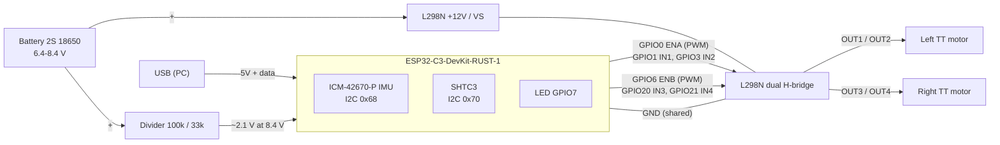

# Wiring

Source of truth for how the prototype is wired. Update it in the same PR as
any firmware change that uses a new pin, and keep the pinout table in
`CLAUDE.md` in sync.

Status: ✅ wired and in use · ⬜ planned, not wired yet. Edit the status column
as parts get connected.

## Overview

Which motor is "left" and which is "right" is decided when the motors are
connected; record it in the table below.

## Connections

| From | To | Signal | Status | Notes |
|---|---|---|---|---|
| PC USB | ESP32-C3 USB-C | 5 V, flashing, USB-Serial-JTAG log | ✅ | Board is powered from USB during development |
| ESP32-C3 GPIO10 / GPIO8 | ICM-42670-P, SHTC3 | I2C SDA / SCL | ✅ | On the board, with pull-ups; nothing to wire |
| ESP32-C3 GPIO7 | LED | Heartbeat | ✅ | On the board |
| ESP32-C3 GPIO0 | L298N ENA | Left motor PWM (LEDC) | ⬜ | ENA jumper removed |
| ESP32-C3 GPIO1 | L298N IN1 | Left motor direction | ⬜ | |
| ESP32-C3 GPIO3 | L298N IN2 | Left motor direction | ⬜ | |
| ESP32-C3 GPIO6 | L298N ENB | Right motor PWM (LEDC) | ⬜ | ENB jumper removed; must stay low during boot (see below) |
| ESP32-C3 GPIO20 | L298N IN3 | Right motor direction | ⬜ | UART0 RX: never log over UART0 |
| ESP32-C3 GPIO21 | L298N IN4 | Right motor direction | ⬜ | UART0 TX: the ROM bootloader toggles it at reset |
| ESP32-C3 GND | L298N GND | Common ground | ⬜ | GND only, not 5 V, while the board runs on USB |
| Battery + | L298N +12V (VS) | Motor supply 6.4-8.4 V | ⬜ | Never to the board's BAT+ (single cell only) |
| Battery − | L298N GND | | ⬜ | |
| L298N OUT1 / OUT2 | Left motor | | ⬜ | Swap the two wires if the motor runs backwards |
| L298N OUT3 / OUT4 | Right motor | | ⬜ | |
| Battery + → 100 kΩ → GPIO4 → 33 kΩ → GND | ESP32-C3 GPIO4 | Battery voltage sense (ADC1) | ⬜ | 8.4 V × 33 / 133 ≈ 2.1 V |
| (spare) | ESP32-C3 GPIO5 | GY-521 INT, if that IMU is ever used | ⬜ | |

## Why these pins

- **Avoided:** GPIO2 (strapping, WS2812 RGB LED), GPIO7 (LED), GPIO9 (BOOT
  button), GPIO8/10 (I2C), GPIO18/19 (USB), GPIO11-17 (module flash).
- **GPIO20/21 are UART0.** The firmware logs over USB-Serial-JTAG only, so
  they are free for IN3/IN4. The ROM bootloader still prints on GPIO21 at
  reset; that is harmless as long as ENB (GPIO6) stays low, so the right
  motor can't move while IN4 toggles.
- **The L298N logic inputs accept 3.3 V** (V_IH min 2.3 V), so no level
  shifters are needed.

## Power

See "Power notes" in `CLAUDE.md`. In short: during development the board runs
from USB and shares only GND with the L298N; the battery feeds the L298N motor
supply only. Add 100-470 µF bulk capacitance near the board before driving the
motors.
